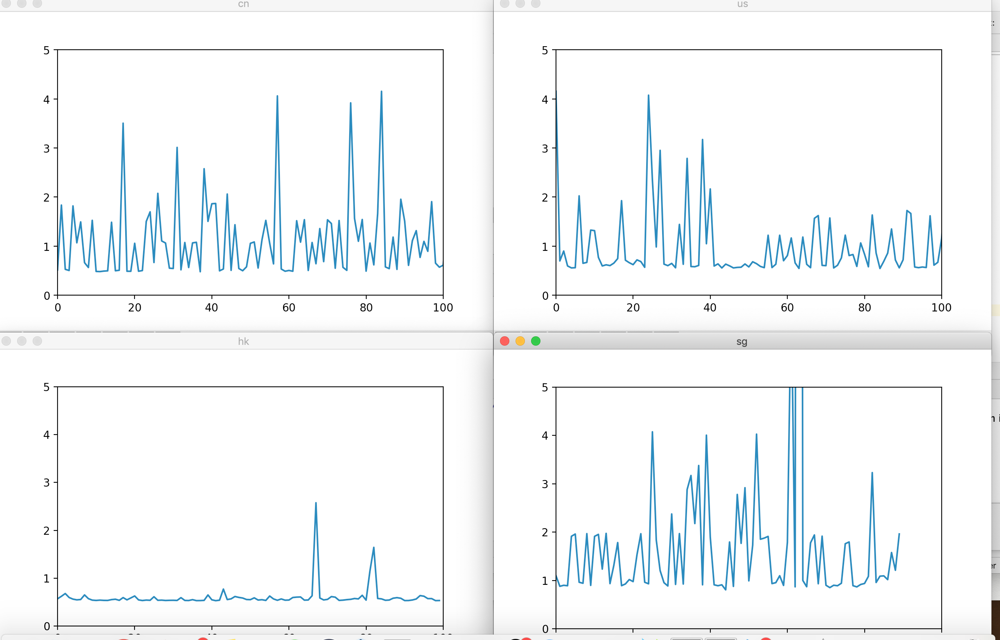

## All in all.it's a story about proxy.I want visit aws faster by a jump server in SGP
```
Author: 9crk 
Date:	2020-03-04
Place: in ShenZhen Intelli-Rocks Tech
```
### some tips
```
 iptables -L		:check all the input/output/forward rules
		when you see multiple rules under INPUT or OUTPUT, it means a rule chain
		the packet ticked out by 1st rule will not goto the 2nd rule
		so when you want your rule take affect. use -I to let your rule in the 1st place
 iptables -I xxx		:let your rule on the 1st place
 iptables -D INPUT 1	:delete the 1st rule in INPUT chain 
 iptables -F	:clear all the rules
 iptables -t nat -L	:check all the nat rules	nat is for router function.you want to use nat. 
		turn on the ip_forward first 
 iptables -t nat -F	:clear all the nat rules
```
### Examples
```
 local packet forwarding. use http://xxx:8088 to visit http://xxx:80
 	iptables -t nat -I PREROUTING -p tcp --dport 8088 -j REDIRECT --to-ports 80
 remote port forwarding. use http://thisServer:8080 to visit http://googleIP:80
	iptables -t nat -A PREROUTING -d thisServerIP -p tcp --dport 8080 -j DNAT --to-destination googleIP:80
        iptables -t nat -A POSTROUTING -d googleIP -p tcp --dport 80 -j SNAT --to thisServerIP
```
 that's all you need to know about iptables. if this document helps you.pls give me a star.
 
 
 And of course, dont forget set ip_forward in sysctl.
 ```
 echo 1 > /proc/sys/net/ipv4/ip_forward
 sysctl -p
 ```
企业网络A测试的结果，hk专线相当稳

但是注意AWS-hk没有专线，相当垃圾。所以一定要找有CN2 hk专线的服务商，阿里hk的IP直接是ban掉的，所以不用考虑了。

国内SZ的阿里云其实也不错，效果也比较稳定。可以用作转发。


